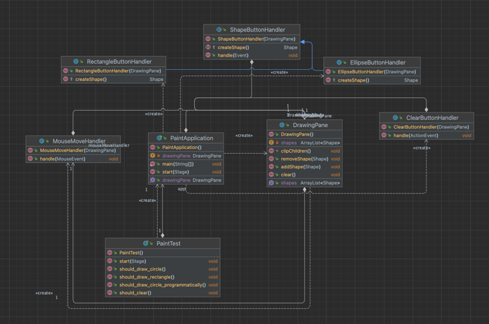

# Minipaint 
## TP1 – Découverte du projet

Dans cette première partie, nous allons nous familiariser avec le code de l’application, et en profiter pour découvrir un ou deux patrons de conception. 

### 🗺 À la recherche des classes perdues...
---
D’abord, importez le projet sous IntelliJ, Eclipse, ou un autre environnement de développement de votre choix. 
Les dépendances du projet sont gérées automatiquement grâce à Maven. Par curiosité, vous pouvez les identifier dans le fichier `pom.xml` :

- openjfx
- junit (pour les tests)
- testfx (pour les tests graphiques)

Compilez le projet, lancez l'application, et testez !
Vous pouvez utiliser la commande `mvn clean javafx:run`

>**🖥 TODO**
>
> - Créez un diagramme des classes, il vous sera utile par la suite.  Pour cela, vous pouvez utiliser un stylo et un papier... 📝
> - Efforcez-vous de comprendre le rôle de chaque classe 🧐

 Les formes géométriques qui sont dessinées sont représentées par des objets, qui sont stockés dans le `DrawingPane`. Mais où sont les classes représentant les différentes formes géométriques ??
>**🖥 TODO**
> - Cherchez un peu, et quand vous aurez trouvé, complétez le diagramme de classes de l'application.

  

### 🌴 Le triangle des bermudes
---
On veut maintenant pouvoir dessiner des triangles.

>**🖥 TODO**
>
> - Décidez quelle classe vous utiliserez pour représenter cette nouvelle forme géométrique.
> - En vous inspirant de la manière dont les rectangles et les ellipses sont créés et ajoutés au `DrawingPane`, ajoutez les classes nécessaires ainsi qu’un bouton dans l’interface pour pouvoir dessiner des triangles.
> - Définissez un style CSS à appliquer aux triangles.

  

### 🩺 Des tests
---
Les tests unitaires sont un excellent moyen de vérifier la qualité du code produit. Il y a beaucoup d’avantages à utiliser les tests unitaires, comme vous le verrez dans un autre module. Au fur et à mesure du développement de l’application, vous devrez écrire les tests permettant de vérifier la validité de votre code, et d’identifier des erreurs possibles. 

Commençons tout de suite !

Dans le package `test`, il y a déjà une classe permettant de tester quelques méthodes de l’application.
>**🖥 TODO**
>
> - En vous inspirant des tests existants, écrivez quelques tests unitaires permettant de vérifier le bon fonctionnement des classes que vous avez ajoutées pour dessiner des triangles. Pensez aux différents cas possibles. 
>
> - Vérifiez que les tests passent, ou corrigez votre code si nécessaire. 
Dans la suite du projet, nous continuerons à écrire des tests pour chaque nouvelle fonctionnalité créée. 

  

### 🎮 Tu me montres ta collection ?
---
La classe `DrawingPane` contient un attribut de type `ArrayList` pour stocker les formes géométriques créées. Pour y accéder, un getter a été implémenté : il s’agit de la méthode `getShapes()`. Il est d’ailleurs utilisé dans la classe `MouseMoveHandler`, par exemple.

>**🖥 TODO**
>
> - Quel problème relatif au principe d’encapsulation ce getter pose-t-il ?

Pour vous en rendre compte, dans la classe `ShapeButtonHandler`, essayez de remplacer la ligne :

    drawingPane.addShape(shape);

par celle-ci :

    drawingPane.getShapes().add(shape);

>**🖥 TODO**
>
> - Que se passe-t-il, et pourquoi ? 👾
> - Qu'est-ce que cela révèle à propos de ce fameux getter ?
> - Un peu de réflexion : Que proposeriez-vous pour corriger ce problème ? 🤷🏽‍

Réfléchissez et proposez une solution avant de [lire la suite... ](./TP1_plus.md)

 

[🔙 Retour](../README.md)