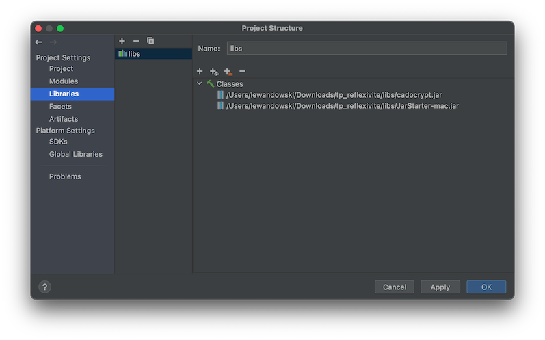
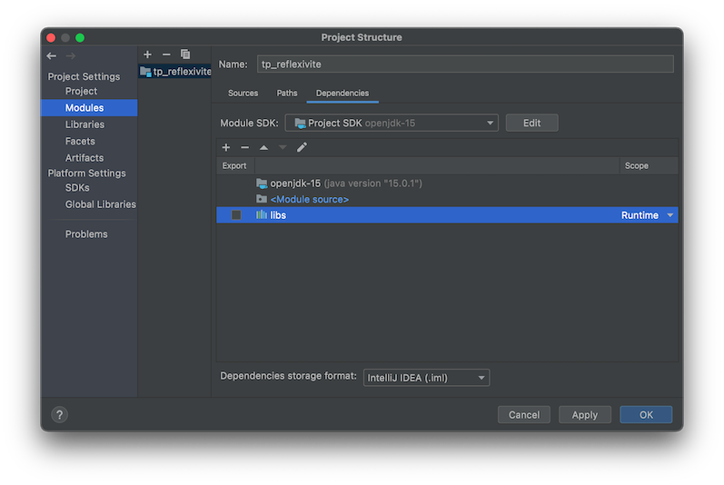

# POOA – TP Introspection et réflexivité
_(inspiré d'un énoncé de Yvan Royon)_

Fait par VITSE MAXIME

## 🎯 But du TP 
Il s'agit d'explorer les mécanismes d'introspection offerts par Java.
Pour cela, nous allons manipuler les classes `Class`, `Object`, 
ainsi que les éléments du package `java.lang.reflect`.

## 🎁 Introduction 

De retour d'un voyage dans un pays lointain, votre papi préféré vous ramène un très beau spécimen : 
une instance de `java.util.Vector` originale, peuplée d'un certain nombre d'éléments. Merci papi !

C'est très gentil de sa part, seulement il est un peu tête-en-l'air : il a oublié de vous dire ce qu'il y avait dans le Vector. 
Pire, il a perdu le code source et la javadoc du programme qui l'a généré. 
Et bien sûr, vous n'avez même pas le ticket de caisse pour vous faire rembourser.

Qu'allez-vous donc faire de ce Vector ? Vous pouvez récupérer le contenu sous forme d'objets (`java.lang.Object`), 
mais vous ne savez pas quoi en faire. Vous ne savez pas vers quelle classe effectuer le transtypage (« cast » en VO), comme vous faites d'habitude :

>  `String s = (String) monVector.get(1);`

Mais rassurez-vous, tout n'est pas perdu (ouf). En effet, Java vous fournit des mécanismes d'introspection et de réflexivité, 
respectivement pour découvrir la structure interne d'une classe ou d'un objet et pour agir dessus.

Vous allez dans ce TP découvrir la classe `java.lang.Class`, la classe `java.lang.Object` et le package `java.lang.reflect`. 
Il s'agit d'outils très puissants et « bas niveau » dans Java, qui rendent possibles des technologies comme RMI ou JavaBeans (cf. sérialisation). 
Vous les utiliserez pour tout découvrir sur le contenu du Vector offert par papi.

## 🎛 Préparation

Dans le dossier `src/`, vous trouverez la classe principale dans laquelle vous allez travailler : la classe `Main`. 
À l'intérieur, le code qui permet de récupérer le vecteur contenant les cadeaux est déjà écrit. 
Quant à la classe `PapiBarbu`, rien d'intéressant pour vous là-dedans.

Dans le dossier `libs/`, vous trouverez les fichiers jars nécessaires à l'exécution du projet, 
dont le fameux `cadocrypt.jar`, un fichier crypté contenant les cadeaux et généré grâce à un simulateur de papi top secret, 
ainsi qu'un jar qui permet de décrypter tout ça. 
Pour démarrer, il faut ajouter ces librairies au projet si ce n'est pas déjà fait. 

Ouvrez les propriétés du projet (`Project Structure`, ou `Module Settings`). 
Dans l'onglet `Libraries`, 
ajouter une librairie et y inclure le fichier `cadocrypt.jar` ainsi que le fichier `JarStarter-[votre_os].jar`



Ensuite, dans l'onglet `Modules` > `Dependencies`, 
changer le scope de la librairie créée pour le mettre à `Runtime`.



> **👊 POUR LA SUITE**
> 
> - Gardez la javadoc sous les yeux : [https://docs.oracle.com/...](https://docs.oracle.com/en/java/javase/11/docs/api/java.base/java/lang/Class.html)
> - Modifiez la classe `Main` et testez/vérifiez vous-mêmes les réponses
> - Dialoguez avec l'enseignant : le but est de comprendre !
> - Ayez l'âme d'explorateur qui anime papi : soyez curieux ... 

## Classe `Object`

En Java, toutes les classes héritent de la classe `Object`. Ceci permet d'une part d'adresser tous les objets de manière générique, par exemple pour les placer dans un Vector, et d'autre part de forcer des comportements génériques à tous les objets. C'est le cas par exemple de la méthode `toString()` :

**Question 1 :** À quoi sert la méthode `toString()` de la classe `Object` ? Qu'est-elle censée nous renvoyer ?

"Returns a string representation of the object." donc la représentation sous forme de String d'un objet Java.

**Question 2 :** Qu'est-ce que cette méthode vous permet de déduire sur chacun des éléments qui sont dans le vecteur ?

```
tpintrospection.Surprise1@4ac68d3e
tpintrospection.Playlist@277c0f21
Muahahahahahahaaaa!!!
interface tpintrospection.CadeauPourri
```

Le Vector contient 4 élèments :
```
1 Class Surprise ;
1 Class Playlist ;
1 String ;
1 Interface CadeauPourri
```

**Question 3 :** Qu'en concluez-vous ?

L'object est un Vecteur qui contient 4 élèments avec 1 cache derrière une interface et 1 méthode toString surchargé.

## Classe `Class` et package `java.lang.reflect`

La classe `java.lang.Class` fournit une représentation des classes. Nous verrons quelle est cette représentation plus loin. `Class` étant une classe, on peut l'instancier... 

**Question 4 :** Mais alors, les classes sont-elles des objets ?

> Indice : ǝᴉɓoๅouᴉɯɹǝʇ. Ne pas confondre la notion de classe et sa représentation interne dans la machine virtuelle. 
Cette représentation interne des classes permet de les introspecter (découvrir leur composition interne).

Non :
"Java classes are not objects, they're an abstraction. However, each Java class has a corresponding instance of the java."

**Question 5 :** À quoi peut-on accéder ?

Repérez comment accéder à la liste des méthodes d'une classe, de ses constructeurs, de ses attributs. Les types retournés par ces méthodes appartiennent au package `java.lang.reflect`.

Voir code

```
//Question 5 : Class class et package java lang reflect
Class reflectPermissionClass = ReflectPermission.class;

Method[] methods = reflectPermissionClass.getMethods();
Constructor[] constructors = reflectPermissionClass.getConstructors();
Field[] fields = reflectPermissionClass.getFields();
Field[] declaredFields = reflectPermissionClass.getDeclaredFields();

display(methods, constructors, fields, declaredFields);
```

**Question 6 :** Quels sont les méthodes, constructeurs, attributs des éléments contenus dans le vecteur ? (Codez !)

Voir code 
```
// Question 6 : sur les elements contenus dans le vecteur
Class objectClass = o.getClass();

Method[] methods2 = objectClass.getMethods();
Constructor[] constructors2 = objectClass.getConstructors();
Field[] fields2 = objectClass.getFields();
Field[] declaredFields2 = objectClass.getDeclaredFields();

display(methods2, constructors2, fields2, declaredFields2);
```

Ex sur un des 4 élèments de Vector :

```
fields: [public int tpintrospection.Surprise1.i]
declaredFields: [public int tpintrospection.Surprise1.i, long tpintrospection.Surprise1.l, protected java.lang.String tpintrospection.Surprise1.name, private double tpintrospection.Surprise1.d]
methods: [public final void java.lang.Object.wait(long,int) throws java.lang.InterruptedException, public final void java.lang.Object.wait() throws java.lang.InterruptedException, public final native void java.lang.Object.wait(long) throws java.lang.InterruptedException, public boolean java.lang.Object.equals(java.lang.Object), public java.lang.String java.lang.Object.toString(), public native int java.lang.Object.hashCode(), public final native java.lang.Class java.lang.Object.getClass(), public final native void java.lang.Object.notify(), public final native void java.lang.Object.notifyAll()]
constructors: [public tpintrospection.Surprise1(), public tpintrospection.Surprise1(int,long,java.lang.String,double)]
```

> À titre d'exemple, choisissez un des éléments du vecteur. Découvrez dynamiquement sa liste de méthodes, et appelez une de ces méthodes. Rappel : lorsque vous codez, vous ne connaissez pas à l'avance le nom de la méthode à invoquer !
> 
> Comparez et testez les méthodes `getFields()` et `getDeclaredFields()`. Que retournent-elles ?

**Question 7 :** Que pouvez-vous dire au sujet de l'encapsulation (Pensez aux mots-clés `private`, `public`) ? Y a-t-il des incidences du point de vue sécurité ? Discutez !

On peut accéder à des méthodes et attributs privées avec la réfléxivité.

**Question 8 :** D'après vous, à quoi ces méthodes peuvent servir dans la vraie vie ? Quelles sortes d'applications pourraient avoir besoin de ce genre de méthodes ?

Pour des frameworks qui ne connaissent pas encore les futures classes par ex.

**Question 9 :** Pourquoi la classe `Class` est-elle `final` ?

Pour bloquer la réfléxivité justement.
"The main purpose of using a class being declared as final is to prevent the class from being subclassed." donc d'éviter l'héritage de class.

## Réfléxivité

Nous avons vu qu'il est possible de récupérer énormément d'informations sur les classes et les objets, y compris ceux que le développeur ne connaît pas à priori. Nous allons maintenant voir qu'il est possible d'agir dessus.

Observez la classe `java.lang.reflect.Field`. Les méthodes `getXX` permettent de lire les valeurs des champs, les méthodes `setXX` de les modifier.


**Question 10 :** Modifiez un attribut public quelconque d'un des éléments contenus dans le vecteur.

> Jusqu'ici, cela correspond à une utilisation normale : `monObjetDeClasseX.unAttributPublic = valeur;`
> 
> La différence est que la classe et le nom de l'attribut sont découverts dynamiquement, sans connaissance préalable.

Etape suivante : par héritage, la classe `Field` dispose d'une méthode `setAccessible()`.

**Question 11 :** Que fait cette méthode ?

Rend accessible le Field donc modifiable (set)

**Question 12 :** Utilisez-la en reprenant vos conclusions aux questions 6, 7 et 10.

## 🚨 Conclusion

Si vous avez bien suivi, vous venez de modifier la valeur d'un champ private appartenant à une instance d'une classe que vous ne connaissez même pas et qui se trouvait dans un fichier jar encrypté. 🤨

Cela signifie que, lorsque vous utilisez Java dans un environnement critique (serveur d'entreprise...), il faut prendre des précautions supplémentaires. C'est également vrai pour .NET, et pour n'importe quelle technologie capable d'introspection et de réflexivité. En Java, on peut se protéger de modifications extérieures en utilisant un « Security Manager ».

**Question 13 :** Faites quelques recherches et implémentez un « Security Manager » basique qui empêche ces modifications.

```
WARNING: A terminally deprecated method in java.lang.System has been called
WARNING: System::setSecurityManager has been called by tpintrospection.Main (file:/Users/maxime/Documents/M2-I2L/POOA/tp_reflexivite/out/production/tp_reflexivite/)
WARNING: Please consider reporting this to the maintainers of tpintrospection.Main
WARNING: System::setSecurityManager will be removed in a future release
Connection is established!
java.security.AccessControlException: access denied ("java.lang.reflect.ReflectPermission" "suppressAccessChecks")
	at java.base/java.security.AccessControlContext.checkPermission(AccessControlContext.java:485)
	at java.base/java.security.AccessController.checkPermission(AccessController.java:1068)
	at java.base/java.lang.SecurityManager.checkPermission(SecurityManager.java:416)
	at java.base/java.lang.reflect.AccessibleObject.checkPermission(AccessibleObject.java:91)
	at java.base/java.lang.reflect.Constructor.setAccessible(Constructor.java:179)
	at tpintrospection.PapiBarbu.vaChercherLesCadeaux(PapiBarbu.java:20)
	at tpintrospection.Main.main(Main.java:21)
```

Il faut décommenter la ligne 15